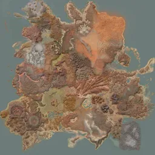

(not affiliated with Kenshi Interactive Map @ www.kenshimap.com)

Kenshi & its in-game map © [Lo-Fi Games](https://lofigames.com/)

# Maps!

[`webp/ingame/`](webp/ingame/) — original map a.k.a. `data/gui/gfx/GUI_Map.dds`.
Original size: 8192×8192px, ~40 MB.
- [`full/`](webp/ingame/full/) — single-image .WEBP versions of the map in sizes from 256×256 to 8192×8192.\
  To use: [`https://raw.githubusercontent.com/Artalus/kenshimap/refs/heads/main/webp/ingame/full/1024.webp`](https://raw.githubusercontent.com/Artalus/kenshimap/refs/heads/main/webp/ingame/full/1024.webp)
  - ` 256.webp` — 12kB
  - ` 512.webp` — 41kB
  - `1024.webp` — 144kB
  - `2048.webp` — 510kB
  - `4096.webp` — 1.8MB
  - `8192.webp` — 6.0MB
- [`tiles/`](webp/ingame/tiles/) — tiled .WEBP versions of the map, in form of `$row_$column`.
Every tile is 256×256px.\
  To use: [`https://raw.githubusercontent.com/Artalus/kenshimap/refs/heads/main/webp/ingame/tiles/2/1_3.webp`](https://raw.githubusercontent.com/Artalus/kenshimap/refs/heads/main/webp/ingame/tiles/2/1_3.webp)
  - `0` — 1x1 grid
  - `1` — 2x2 grid
  - `2` — 4x4 grid
  - `3` — 8x8 grid
  - `4` — 16x16 grid
  - `5` — 32x32 grid
